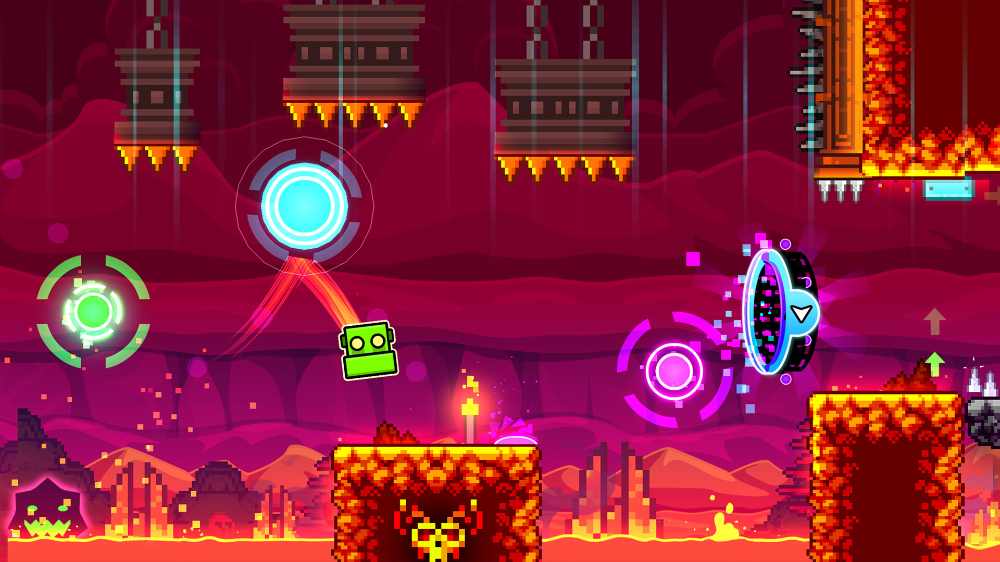
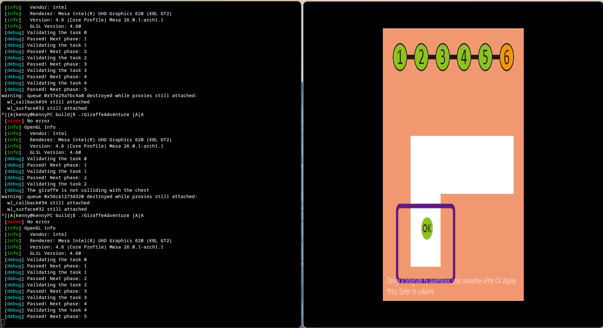
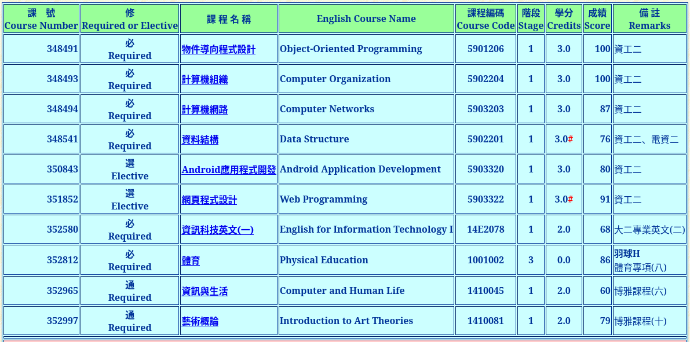

# Abstract

遊戲名稱：Geometry Dash

組員：

- 113590015 廖肯立

# Game Introduction

Geometry Dash 是一個節奏跑酷遊戲，玩家會成為遊戲中的正方形，在場地上不停向前移動。過程中會有各種陷阱，玩家隨著音樂**點擊跳動，躲避前方的陷阱與障礙物**。根據遊戲階段的不同，玩家還會**化身宇宙飛船在在遊戲中翱翔**。重要的是越後面的關卡**難度成倍增加，會有彈跳床、反重力裝置、金幣**，去陷害玩家死亡。當玩家一次一次的失敗，最後終於走到終點時，玩家的成就感會達到史無前例的高潮。而等待玩家的卻是無止境的關卡，讓玩家在成功與失敗中反覆橫跳。

# Development timeline

- Week 2：撰寫 Proposal、完成練習
  - [ ] 撰寫 Proposal
  - [ ] 完成 Giraffe Adventure 練習
- Week 3：處理環境設定、素材與遊戲架構
  - [ ] 建制初始環境
  - [ ] 擬定遊戲架構：物件導向設計、動畫設計、物理碰撞、遊戲狀態機
  - [ ] 蒐集遊戲的素材：角色、場景界面
- Week 4：優先撰寫遊戲內容
  - [ ] 開始撰寫遊戲內容：重力、物件的移動
  - [ ] 引入音樂
  - [ ] 使關卡模塊化設計：加入更多關卡能夠直接新增關卡檔案去完成
- Week 5：繼續撰寫遊戲內容
  - [ ] 與 week 3 相同
- Week 6：繼續撰寫遊戲內容
  - [ ] 預計本週完成遊戲的關卡部分：角色、物件、背景的移動
  - [ ] 設計：碰撞箱、死亡檢測與、自動重開
- Week 7：撰寫撰寫遊戲內容
  - [ ] 預計完成：碰撞箱、死亡檢測與、自動重開
  - [ ] 順手規劃起始界面
- Week 8：緩衝周
  - [ ] 磨合已有內容
  - [ ] 利用本周修補內容，確保符合進度
- Week 9：開始設計界面
  - [ ] 取得界面素材
  - [ ] 設計起始界面
  - [ ] 設計關卡列表
  - [ ] 構想角色選擇器
  - [ ] 構想界面切換動畫
- Week 10：撰寫界面
  - [ ] 主界面、角色選擇器、設定界面
  - [ ] 訂定幫助佈局物件
- Week 11：繼續撰寫界面
  - [ ] 會完成主界面、角色選擇器、設定界面
- Week 12：緩衝周
  - [ ] 時界面與遊戲內容，能夠順利橋接、切換
  - [ ] 並且修補內容
- Week 13：加入更多關卡、可能會用到更多物件
  - [ ] 後面的關卡有更多陷阱需要設計，需要設計更多陷阱
  - [ ] 重力反轉物件
- Week 14：設計動畫
  - [ ] 為遊戲添加更多動畫
  - [ ] 其他動態效果
- Week 15：開始檢查遊戲
  - [ ] 檢查並處理遊戲問題
  - [ ] 美化城程式碼、優化運行效率
- Week 16：處理問題
  - [ ] 同上周，繼續優化遊戲：調整遊戲手感
  - [ ] 請朋友試玩，看有沒有與原版相差的問題
  - [ ] 處理遊戲是否有卡頓的問題
  - [ ] 有未處理的事情，可以壓縮本周
- Week 17：整理發表內容
  - [ ] 整理製作心得、操作方式、遊戲架構與遊玩影片
  - [ ] 生產出遊戲簡報
  - [ ] 產出遊戲文檔
  - [ ] 提交驗收

# Giraffe Adventure 完成證明

# OOP 修課證明

